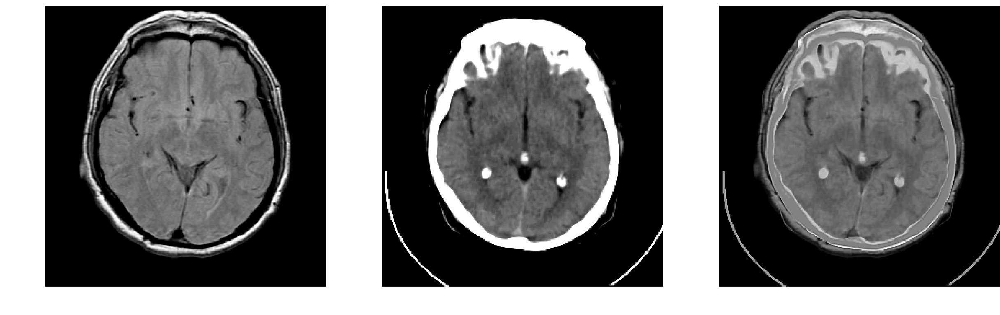
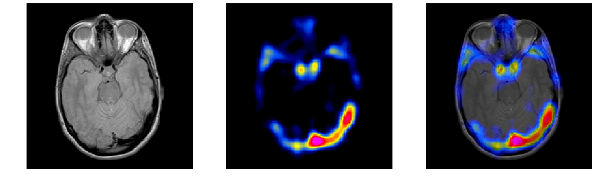

# Zero-Learning Fast Medical Image Fusion
[[Home]](http://fayez.me)

Official implementation of Zero-Learning Fast Medical Image fusion.
**Faster** and **Higher Quality** image fusion using pre-trained neural networks.

## Overview


This is the author's implementation of medical image fusion using pre-trained neural networks described in:

**Zero-Learning Fast Medical Image Fusion**  
Fayez Lahoud, Sabine Süsstrunk  
FUSION 2019

Given a set of pre-aligned images, our algorithm geneates a high quality fusion reflecting the relevant features from all the inputs.

Contact: Fayez Lahoud (fayez.lahoud@epfl.ch)

## Citation
```
@inproceedings{fayez2019zero,
title={Zero-learning fast medical image fusion},
author={Fayez, Lahoud and Sabine, Süsstrunk}
booktitle={2019 22nd International Conference on Information Fusion (Fusion)},
year={2019},
organization={IEEE}
}
```
